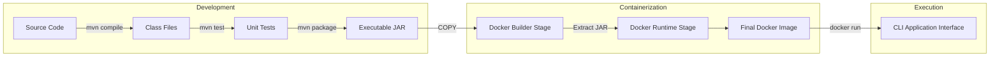

# PROJECT REPORT

**Password Strength Checker Application**

## 1. Introduction and Objectives

The Password Strength Checker is a Java-based command-line utility designed to evaluate the security of user passwords. Since weak passwords are a common entry point for unauthorized access, this tool aims to educate users by providing instant, actionable feedback on their password choices.

**Objectives:**

- Develop a robust password analysis system using regular expressions.
- Evaluate passwords based on length, character diversity, and common predictable patterns.
- Classify passwords into distinct strength categories (Weak, Medium, Strong).
- Provide specific recommendations for improving weak passwords.
- Containerize the application for easy distribution and deployment.

## 2. Tools and Technologies Used

- **Java 11:** Main application logic.
- **Apache Commons Lang 3.14.0:** Utilized for safe string operations (`StringUtils`).
- **JUnit 4.13.2:** For executing unit tests to ensure evaluation logic accuracy.
- **Maven 3.9:** Build management, dependency resolution, and packaging.
- **Docker:** Multi-stage containerization to package the application and its runtime environment.
- **Workflow Focus:** (Docker+Maven).

## 3. System Architecture and Workflow

w
The system is structured as a layered command-line application where user input is validated, evaluated by a scoring engine, and formatted for output. The deployment workflow utilizes Maven for building the artifact and Docker for containerization.

**Deployment Workflow:**

## 4. Implementation Details

The core logic resides in `PasswordStrengthChecker.java`. The evaluation process works as follows:

1. **Input Handling:** The application runs an infinite loop using `Scanner` to accept user input until 'quit' is typed.
2. **Regex Validation:** Pre-compiled patterns check for character diversity:
   - `[A-Z]` for uppercase
   - `[a-z]` for lowercase
   - `[0-9]` for digits
   - Special characters matching.
3. **Scoring Mechanism:** A point system (0-8) is used. Points are awarded for length and character types, and deducted for common patterns (e.g., "123", "password") or repeated characters (e.g., "aaa").
4. **Docker Implementation:** A multi-stage Dockerfile is used. Stage 1 uses Maven to build the JAR. Stage 2 uses a lightweight `eclipse-temurin:11-jre-alpine` image to run the JAR, keeping the final image size small.

_(Include Screenshots here demonstrating:_
_- Compiling the code with Maven._
_- A weak password evaluation._
_- A strong password evaluation._
_- Building and running the Docker container.)_

## 5. Results, Observations, and Conclusion

**Results:**
The application successfully runs in both local Java environments and Docker containers. It accurately categorizes passwords. For example, "password123" is flagged as weak due to common patterns, while "MyStr0ng!P@ssw0rd" receives a perfect score of 8/8. All 24 JUnit test cases pass, verifying the logic against various edge cases.

**Observations:**

- Regex pattern compilation at the class level significantly improves evaluation speed compared to compiling on every check.
- Multi-stage Docker builds reduced the final image size from over 700MB (Maven base image) to roughly 180MB (JRE Alpine image).
- Providing specific feedback (e.g., "Add more special characters") is much more useful to a user than simply outputting "Weak".

**Conclusion:**
The project met all its initial objectives, resulting in a reliable and educational security tool. By integrating Maven and Docker, the project also serves as a practical demonstration of modern Java build and deployment workflows. The code is modular, well-tested, and easy to run across different operating systems.
