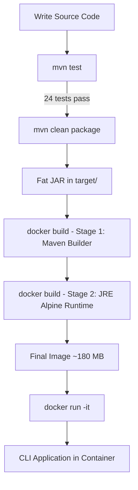

# SYNOPSIS

**Project Title:** Password Strength Checker Application
**Technology Stack:** Docker + Maven
**Submitted By:** [Student Name] | **Roll No.:** [Roll Number]
**Course:** [Course Name] | **Institution:** [Institution Name] | **Year:** 2024-2025

---

## 1. Problem Statement

Weak passwords remain one of the leading causes of data breaches. Users frequently rely on predictable choices such as "password123" or "admin" because they receive no meaningful feedback at the point of creation. This project builds a Java-based command-line application that evaluates password strength in real time, assigns a score from 0 to 8, classifies the result as Weak, Medium, or Strong, and provides specific feedback explaining what is wrong and how to fix it. The application is packaged with Docker for portable, environment-independent execution and built with Maven for reproducible dependency management.

---

## 2. Tools and Technologies Used

**Workflow:** Docker + Maven

| Tool | Version | Role |
|---|---|---|
| Java | 11 (LTS) | Core application language |
| Apache Commons Lang | 3.14.0 | StringUtils for safe blank-input validation |
| JUnit | 4.13.2 | Unit testing (24 test cases) |
| Apache Maven | 3.9 | Build automation, dependency management, fat JAR packaging |
| Docker | Latest | Multi-stage containerization for portable deployment |

Maven plugins used: `maven-compiler-plugin` (3.11.0), `maven-shade-plugin` (3.5.1) for fat JAR, `maven-surefire-plugin` (3.2.2) for test execution, and `exec-maven-plugin` (3.1.0) for direct run.

---

## 3. Architecture / Workflow Diagram (CI/CD Pipeline)

The project follows a Docker + Maven local development and deployment workflow:

```
  [Source Code]
       |
       v
  mvn test  -->  24 JUnit tests must pass
       |
       v
  mvn clean package  -->  Fat JAR (target/password-strength-checker-1.0.0.jar)
       |
       v
  docker build
    Stage 1 (Builder): maven:3.9.5-eclipse-temurin-11
      - Copies source, runs mvn clean package -DskipTests
    Stage 2 (Runtime): eclipse-temurin:11-jre-alpine (~180 MB)
      - Copies only the JAR, sets ENTRYPOINT
       |
       v
  docker run -it password-strength-checker
       |
       v
  [Interactive CLI running inside container]
```



The scoring algorithm used internally:

| Criterion | Points |
|---|---|
| Length 12+ chars | +3 |
| Length 8-11 chars | +2 |
| Length 6-7 chars | +1 |
| Uppercase present | +1 |
| Lowercase present | +1 |
| Digits present | +1 |
| Special characters present | +2 |
| Common pattern detected | -2 |
| 3+ repeated characters | -1 |

Score < 3 = **WEAK** | Score 3-5 = **MEDIUM** | Score 6+ = **STRONG**

---

## 4. Expected Results and Conclusion

**Expected Results:**

- `"password123"` -> **WEAK** (common pattern "password" and "123" detected, -2 points)
- `"MyPass123"` -> **MEDIUM** (no special characters, score 4/8)
- `"MyStr0ng!P@ssw0rd"` -> **STRONG** (score 8/8, all criteria met)
- All 24 JUnit test cases pass with zero failures
- Docker image builds successfully at approximately 180 MB
- Application runs identically on any machine with Docker installed

**Conclusion:**

The Password Strength Checker meets all its objectives. It provides real-time, criterion-specific feedback that helps users understand exactly why a password is weak and what to improve. The Maven build pipeline ensures reproducible compilation and testing, while the multi-stage Docker build produces a lean, portable container image that requires no local Java installation to run. The project demonstrates a practical end-to-end DevOps workflow -- from writing and testing code to containerized deployment -- using industry-standard tools.

---

*References: Oracle Java SE 11 Docs | Apache Commons Lang | Apache Maven | Docker Multi-stage Builds | JUnit 4 | NIST SP 800-63B | Verizon DBIR 2023*
